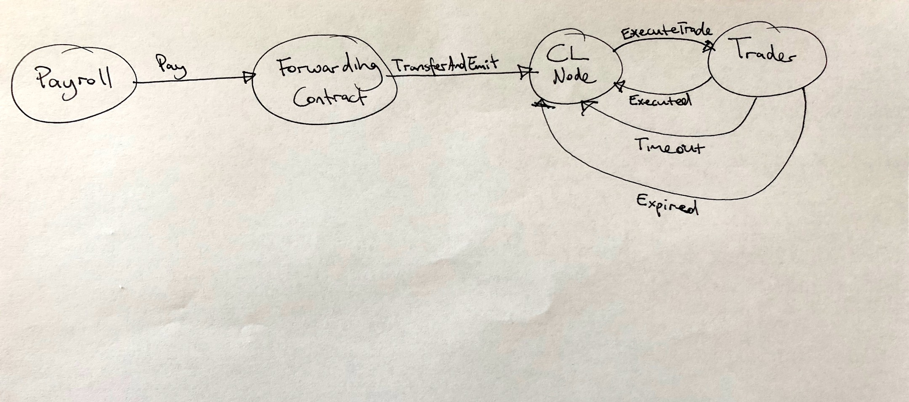

# pancake

pancake flattens volatility in ETH -> USD payments

This is a simple hack day project which aims to solve a very simple problem,
using chainlink:

  1. Receive some ETH at an address
  2. Automatically transfer that ETH to an exchange wallet
  3. Sell that ETH for USD at the exchange

# Who

 @j16r and @rupurt

# What

So far the plan is to have:

  1. A receiving Solidity contract, that upon transfer of some ETH, transfers to a new target address (your exchange's wallet) and creates a RunLog for chainlink
  2. A JobSpec that listens for the above RunLog and triggers an external adaptor
  3. A small service, likely written in Node/JS, that upon triggering by chainlink, will watch for the amount to be deposited in the exchange, then trigger a sell.

