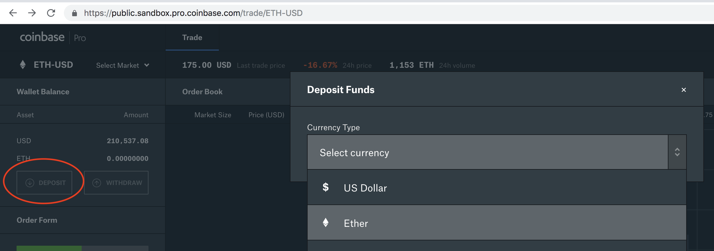
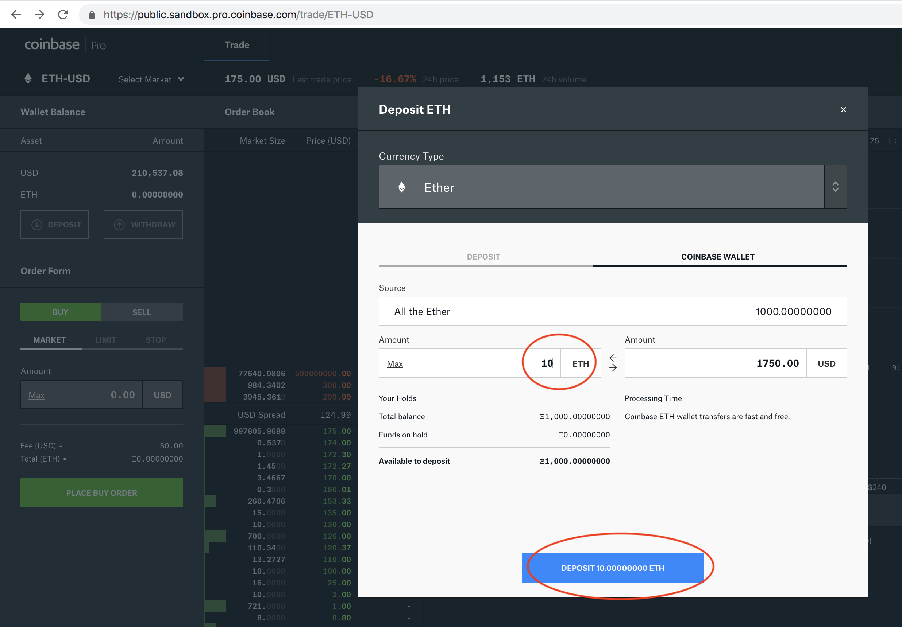
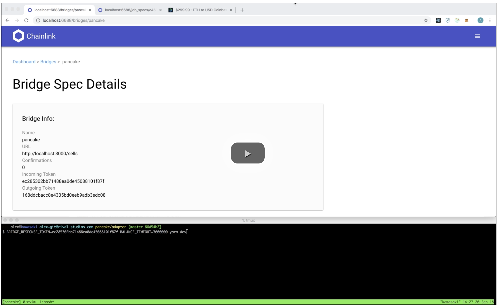
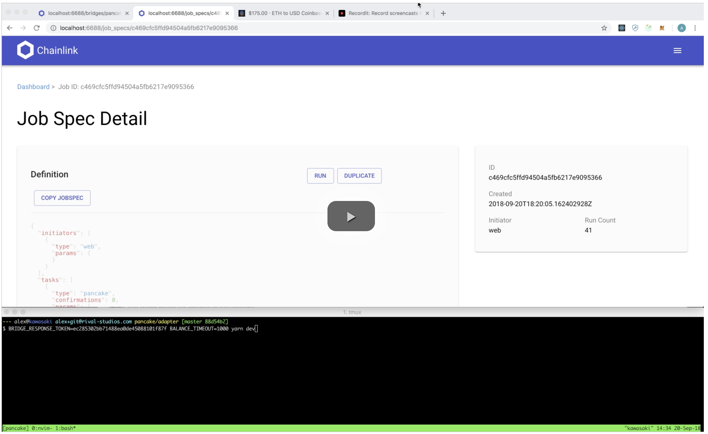

# pancake

pancake flattens volatility in ETH -> USD payments

This is a simple hack day project which aims to solve a very simple problem,
using chainlink:

  1. Receive some ETH at an address
  2. Automatically transfer that ETH to an exchange wallet
  3. Sell that ETH for USD at the exchange

# Who

 @j16r and @rupurt

# What

So far the plan is to have:

  1. A receiving Solidity contract, that upon transfer of some ETH, transfers to a new target address (your exchange's wallet) and creates a RunLog for chainlink
  2. A JobSpec that listens for the above RunLog and triggers an external adaptor
  3. A small service, likely written in Node/JS, that upon triggering by chainlink, will watch for the amount to be deposited in the exchange, then trigger a sell.

# How

So how do you use this? First you'll need:

  1. NodeJS + npm/yarn. NodeJS >= 8.x
  2. A running Ethereum node, with RPC listening on 18545
  3. An Ethereum wallet to get ETH shipped to

### Pancake Trader Setup:

  1. Create a [GDAX sandbox account](https://public.sandbox.pro.coinbase.com)
  2. Create [API credentials](https://public.sandbox.pro.coinbase.com/profile/api) with view & trade permissions
  3. Store the API credentials in a `.env` file and apply them to your current shell `source .env`
  4. Start the `pancake-trader` service `npm run dev / yarn dev` ([configuration options](./PANCAKE_TRADER_CONFIGURATION_OPTIONS.md))

### Chainlink Setup Directions:

  1. Create an ethereum account, with geth you can do `geth account new`
  2. Migrate the job spec and contract with: `WALLET_ADDRESS=$YourWalletAddress npm run deploy`

### Run Demo Directions

  1. Transfer some coins to your contract address!
  2. This will trigger the job run on your Chainlink node. Verify that the job 
  run has sent the request from the bridge adapter by checking the `pancake-trader` 
  logs. You should see the following message every 100ms `... No ETH balance to sell. Check balance again in 100ms`
  3. Simulate GDAX crediting your account by depositing funds into the sandbox
  
  
  4. Verify that `pancake-trader` has sold your ETH by checking for the log `✔✔✔ Successfully sold 10 ETH`
  5. Verify that GDAX has sold your ETH by checking the [filler orders](https://public.sandbox.pro.coinbase.com/orders/filled)

# Demos

### Successful Web Initiator

### Timed Out Web Initiator

